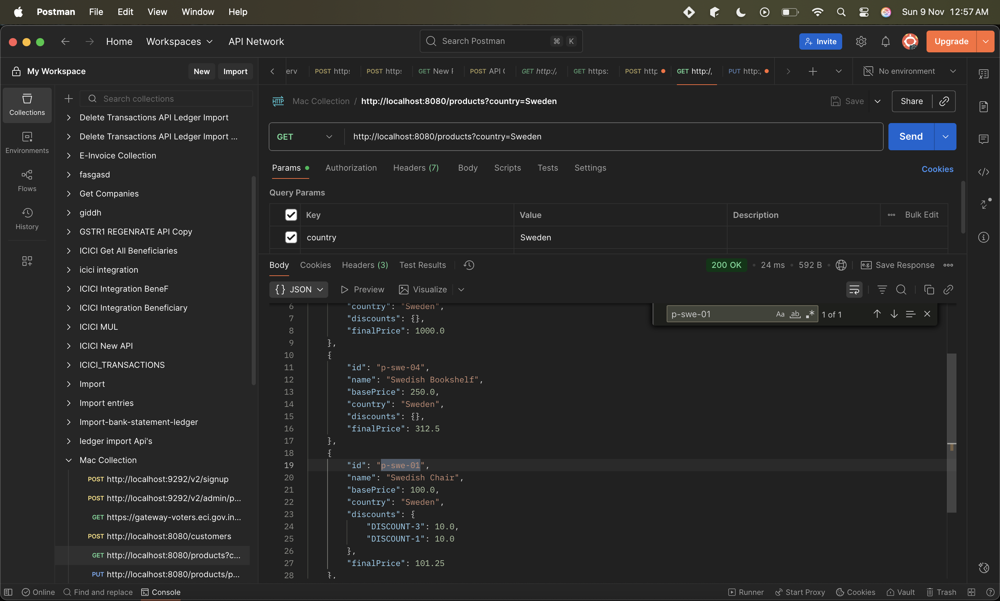
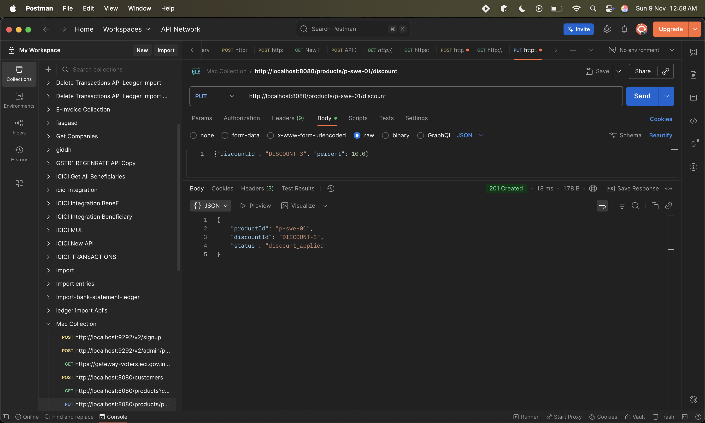

# catalog-api

This project was created using the [Ktor Project Generator](https://start.ktor.io).

Here are some useful links to get you started:

- [Ktor Documentation](https://ktor.io/docs/home.html)
- [Ktor GitHub page](https://github.com/ktorio/ktor)
- The [Ktor Slack chat](https://app.slack.com/client/T09229ZC6/C0A974TJ9). You'll need to [request an invite](https://surveys.jetbrains.com/s3/kotlin-slack-sign-up) to join.

## Features

Here's a list of features included in this project:

| Name                                               | Description                                                 |
| ----------------------------------------------------|------------------------------------------------------------- |
| [Routing](https://start.ktor.io/p/routing-default) | Allows to define structured routes and associated handlers. |

## Building & Running

To build or run the project, use one of the following tasks:

| Task                                    | Description                                                          |
| -----------------------------------------|---------------------------------------------------------------------- |
| `./gradlew test`                        | Run the tests                                                        |
| `./gradlew build`                       | Build everything                                                     |
| `./gradlew buildFatJar`                 | Build an executable JAR of the server with all dependencies included |
| `./gradlew buildImage`                  | Build the docker image to use with the fat JAR                       |
| `./gradlew publishImageToLocalRegistry` | Publish the docker image locally                                     |
| `./gradlew run`                         | Run the server                                                       |
| `./gradlew runDocker`                   | Run using the local docker image                                     |

If the server starts successfully, you'll see the following output:

```
2024-12-04 14:32:45.584 [main] INFO  Application - Application started in 0.303 seconds.
2024-12-04 14:32:45.682 [main] INFO  Application - Responding at http://0.0.0.0:8080
```

## API CURL

```aiignore
curl --location 'http://localhost:8080/products?country=Sweden' \
--header 'Accept: application/json'
```


```aiignore
curl --location --request PUT 'http://localhost:8080/products/p-swe-01/discount' \
--header 'Content-Type: application/json' \
--data '{"discountId": "DISCOUNT-1", "percent": 10.0}'


```



## TEST CASE

This test verifies that discounts are applied to a product safely under concurrent requests, ensuring no duplicate application of the same discount.

## About API

This file defines the HTTP routes (endpoints) for your Ktor-based Product Catalog API.
It handles incoming client requests for:

Fetching products by country

Applying discounts to specific products

It delegates the actual business logic to the CatalogService.